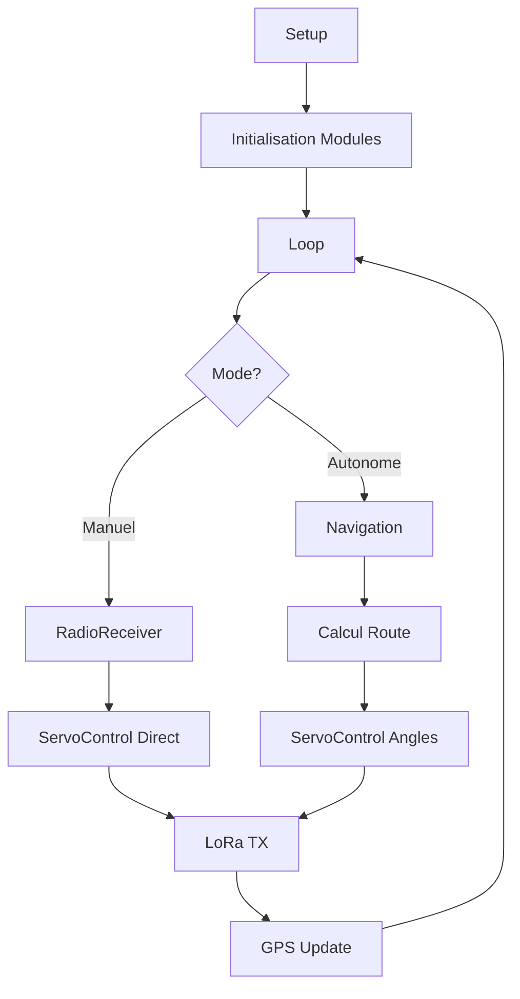

# Architecture du code

## Structure des fichiers

Le projet AutoBoat est organisé de manière modulaire avec une architecture claire :

```
boat/
├── boat.ino              # Fichier principal (setup, loop, logique principale)
├── config_pins.h         # Configuration des pins GPIO
├── Gps.hpp / Gps.cpp     # Module GPS
├── ServoControl.hpp / ServoControl.cpp  # Module contrôle servomoteurs
├── RadioReceiver.hpp / RadioReceiver.cpp # Module récepteur radio
└── MotorControl.hpp / MotorControl.cpp   # Module contrôle moteur
```

## Fichier principal : `boat.ino`

### Vue d'ensemble

Le fichier `boat.ino` est le point d'entrée du système. Il orchestre tous les modules et gère la logique principale.

### Structure principale

```cpp
// Includes et instances
#include "config_pins.h"
#include "Gps.hpp"
#include "ServoControl.hpp"
// ...

GPS gpsBoat;
ServoControl servoControl;
RadioReceiver radioReceiver;
MotorControl motorControl;

// Variables globales
String boatMode = "setup";
int sendInterval = 1000;
// ...

void setup() {
    // Initialisation de tous les modules
}

void loop() {
    // Boucle principale
}
```

### Fonctions principales

#### `setup()`
Initialise tous les modules dans l'ordre :
1. **LoRa** : Communication longue portée
2. **GPS** : Localisation (avec attente du fix)
3. **Servos** : Contrôle des servomoteurs
4. **RadioReceiver** : Détection du mode
5. **MotorControl** : Contrôle du moteur

#### `loop()`
Boucle principale qui exécute :
1. **handleServoControl()** : Gestion des servos (manuel ou autonome)
2. **Réception LoRa** : Lecture des messages entrants
3. **Réception série** : Messages de debug
4. **Envoi périodique** : Télémetrie toutes les secondes
5. **Gestion navigation** : Si en mode autonome

#### `handleServoControl()`
Gère le contrôle des servomoteurs selon le mode :
- **Mode manuel** : Copie directe des signaux PWM de la radiocommande
- **Mode autonome** : Utilise les angles calculés par la navigation

#### `handleNavigation()`
Logique de navigation autonome :
- Calcul de la route vers le waypoint
- Adaptation au vent (VDB, Lofer, Abattre)
- Calcul des angles de voile et gouvernail

#### `parseMessage(String data)`
Parse les messages JSON reçus :
- **Waypoints** : Reçoit et stocke les waypoints
- **Commandes** : Exécute les commandes (wind-observation, etc.)

#### `sendInfo()`
Envoie la télémetrie périodique via LoRa :
- Position GPS
- Angles des servos
- Mode de contrôle
- Cap et vent
- Statut des waypoints

## Module GPS : `Gps.hpp` / `Gps.cpp`

### Responsabilités

- Lecture de la position GPS via Serial1
- Calcul de la distance et cap vers un waypoint
- Filtrage et lissage des positions
- Historique des caps pour stabilité

### Fonctions principales

```cpp
void init();                    // Initialise le GPS
void upDatePosition();          // Met à jour la position
void computeDirectPath(...);     // Calcule route vers waypoint
double getLat() / getLng();     // Position actuelle
double getHeading();             // Cap vers waypoint
double getSmoothHeading();       // Cap lissé
int getStatus();                 // Statut GPS (0/1/2)
```

### Statuts GPS

- **0** : Aucun signal GPS détecté
- **1** : Recherche de satellites (locating)
- **2** : Fix GPS obtenu (position valide)

## Module ServoControl : `ServoControl.hpp` / `ServoControl.cpp`

### Responsabilités

- Contrôle des servomoteurs Sail (voile) et Rudder (gouvernail)
- Utilisation du PWM hardware ESP32 pour précision
- Limitation des angles pour sécurité
- Support mode direct (copie signal PWM)

### Fonctions principales

```cpp
void init();                           // Initialise les servos
void setSailAngle(float angle);        // Angle voile (-10° à +10°)
void setRudderAngle(float angle);      // Angle gouvernail (-45° à +45°)
void setAnglesDirect(int sail, int rudder);  // Mode direct (PWM)
```

### Configuration PWM

- **Fréquence** : 50 Hz (standard servos)
- **Pulse min** : 500 µs
- **Pulse max** : 2400 µs
- **Angles Sail** : -10° à +10°
- **Angles Rudder** : -45° à +45°

## Module RadioReceiver : `RadioReceiver.hpp` / `RadioReceiver.cpp`

### Responsabilités

- Lecture des signaux PWM du récepteur radio
- Détection du mode (manuel/autonome) via canal SEL
- Conversion PWM → angles servo
- Détection des changements de mode

### Fonctions principales

```cpp
void init();                      // Initialise le récepteur
void update();                    // Lit les signaux PWM
bool isRadioControlMode();        // Mode actuel
bool hasModeChanged();            // Changement de mode détecté
int getPWM1() / getPWM2();        // Valeurs PWM brutes
```

### Détection du mode

- **SEL = 0** : Mode autonome
- **SEL = 1** : Mode radiocommande (manuel)

## Module MotorControl : `MotorControl.hpp` / `MotorControl.cpp`

### Responsabilités

- Contrôle du moteur via ESC
- Séquence d'armement de l'ESC
- Gestion de la vitesse

### Fonctions principales

```cpp
void init();                      // Initialise le contrôleur
void arm();                       // Arme l'ESC
void disarm();                    // Désarme l'ESC
void setSpeed(int speed);         // Définit la vitesse
```

## Configuration : `config_pins.h`

### Contenu

Ce fichier centralise **toutes les définitions de pins** :

- **Pins LoRa** : SPI (MISO, MOSI, SCK, CS, RST, IRQ)
- **Pins GPS** : Serial1 (RX, TX)
- **Pins Servos** : PWM output (Sail, Rudder)
- **Pins Radio** : PWM input (CH1, CH2, SEL)
- **Pins Moteur** : PWM output (ESC)

### Avantages

- **Centralisation** : Toutes les pins au même endroit
- **Maintenabilité** : Facile de changer les pins
- **Documentation** : Commentaires explicatifs
- **Compatibilité** : Adapté pour TTGO T-Beam V1.1

## Flux de données global

### Mode Autonome

```
GPS → Position/Cap
  ↓
Navigation Logic → Calcul route + adaptation vent
  ↓
ServoControl → Commande servomoteurs
  ↓
LoRa → Envoi télémetrie
```

### Mode Manuel

```
RadioReceiver → Lecture PWM radiocommande
  ↓
ServoControl → Copie directe des signaux
  ↓
LoRa → Envoi télémetrie (optionnel)
```

### Communication LoRa

```
Station PC → LoRa → Bateau : Waypoints/Commandes
Bateau → LoRa → Station PC : Télémetrie
```

## Gestion des modes

Le système gère plusieurs modes :

1. **setup** : Initialisation
2. **setup-ready** : Prêt, en attente
3. **standby** : En attente de waypoints
4. **route-ready** : Waypoints reçus, prêt à naviguer
5. **wind-observation** : Observation du vent
6. **wind-ready** : Vent mesuré, prêt à naviguer
7. **navigate** : Navigation active vers waypoint

## Points importants

### Performance

- **PWM hardware** : Utilise les timers hardware ESP32 pour précision
- **Non-bloquant** : Pas de `delay()` dans la boucle principale
- **Filtrage GPS** : Lissage des positions pour stabilité

### Sécurité

- **Limitation angles** : Servos limités dans leurs angles
- **Détection mode** : Basculement automatique manuel/autonome
- **Vérification LoRa** : Réinitialisation automatique si problème

### Modularité

- **Séparation des responsabilités** : Chaque module a un rôle précis
- **Interface claire** : Headers avec documentation
- **Configuration centralisée** : `config_pins.h`

## Diagramme de flux



---

*Pour plus de détails sur les fonctions, voir [API Reference](api.md)*

