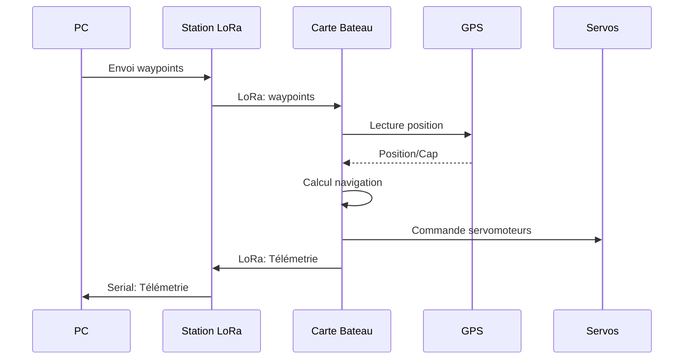

# Fonctionnement du système

## Architecture générale

Le système AutoBoat est composé de **deux cartes principales** qui communiquent via LoRa :

1. **Carte embarquée (Bateau)** : ESP32 sur le voilier
2. **Carte réceptrice (PC/Station)** : ESP32 connecté à un ordinateur pour le contrôle

```
┌─────────────────┐         LoRa          ┌─────────────────┐
│                 │ ◄──────────────────► │                 │
│  Carte Bateau   │                       │  Carte Récepteur │
│   (ESP32)       │                       │   (ESP32 + PC)  │
│                 │                       │                 │
└─────────────────┘                       └─────────────────┘
```

## Carte embarquée (Bateau)

La carte embarquée est installée sur le voilier et gère :

### Modules intégrés

- **GPS** : Localisation en temps réel
- **LoRa** : Communication avec la station
- **RadioReceiver** : Détection du mode manuel/autonome
- **ServoControl** : Contrôle des servomoteurs (voile et gouvernail)
- **MotorControl** : Contrôle du moteur ESC

### Fonctionnalités

1. **Réception des commandes** : Reçoit les waypoints et commandes via LoRa
2. **Navigation autonome** : Calcule la route vers les waypoints
3. **Adaptation au vent** : Ajuste la navigation selon les conditions
4. **Télémetrie** : Envoie la position, cap, et statut
5. **Basculement de mode** : Passe automatiquement en mode manuel si radiocommande active

### Flux de données

```
GPS → Position/Cap
  ↓
Navigation Logic → Calcul route
  ↓
ServoControl → Commande servomoteurs
  ↓
LoRa → Envoi télémetrie
```

## Carte réceptrice (Station de contrôle)

La carte réceptrice est connectée à un ordinateur et permet :

### Fonctionnalités

1. **Réception télémetrie** : Reçoit les données du bateau
2. **Envoi de commandes** : Envoie les waypoints et instructions
3. **Interface PC** : Communication série avec l'ordinateur
4. **Relais LoRa** : Transmet les messages entre PC et bateau

### Communication avec le PC

La carte réceptrice communique avec le PC via **Serial (USB)** :

```
PC (Python/Interface) → Serial → ESP32 Récepteur → LoRa → Bateau
```

## Protocole de communication LoRa

### Format des messages

Tous les messages utilisent le format **JSON** :

#### Message de télémetrie (Bateau → Station)

```json
{
  "origin": "boat",
  "type": "info",
  "message": {
    "mode": "navigate",
    "location": [48.123456, 2.123456],
    "servos": {
      "sail": 10,
      "rudder": -20
    },
    "control_mode": "autonomous",
    "heading": 45,
    "wind": 180,
    "waypoints": {
      "total": 3,
      "current": 1
    }
  }
}
```

#### Message de commande (Station → Bateau)

```json
{
  "origin": "server",
  "type": "command",
  "message": "waypoints:48.123,2.123|48.456,2.456|48.789,2.789"
}
```

### Fréquence et paramètres LoRa

- **Fréquence** : 868 MHz (configurable dans `config_pins.h`)
- **Spreading Factor** : 7
- **Bandwidth** : 125 kHz
- **Coding Rate** : 4/5

## Modes de fonctionnement

### Mode Manuel

Le bateau est contrôlé directement via la **radiocommande** :

- Les signaux PWM de la radiocommande sont copiés directement aux servomoteurs
- Le mode est détecté automatiquement via le canal SEL de la radiocommande
- Aucune navigation autonome n'est active
- La télémetrie continue d'être envoyée

### Mode Autonome

Le bateau navigue automatiquement :

- Navigation vers les waypoints GPS
- Adaptation au vent (VDB, Lofer, Abattre)
- Calcul de route optimale
- Envoi de télémetrie régulier

### Basculement automatique

Le système bascule automatiquement entre les modes :

- **Manuel → Autonome** : Si le canal SEL passe en position autonome
- **Autonome → Manuel** : Si le canal SEL passe en position manuel

## Diagramme de séquence



## Images et schémas

### Schéma de connexion des modules

*Schéma de connexion des modules - À ajouter dans `docs/images/wiring-diagram.png`*

### Schéma de communication LoRa

*Schéma de communication LoRa - À ajouter dans `docs/images/lora-communication.png`*

### Diagramme de flux des données

*Diagramme de flux des données - À ajouter dans `docs/images/data-flow.png`*

### Photos des cartes

#### Carte embarquée (Bateau)

*Photo de la carte ESP32 sur le bateau - À ajouter dans `docs/images/board-boat.jpg`*

#### Carte réceptrice (Station)

*Photo de la carte réceptrice - À ajouter dans `docs/images/board-receiver.jpg`*

---

*Pour plus de détails sur l'installation, voir [Démarrage](demarrage.md)*

